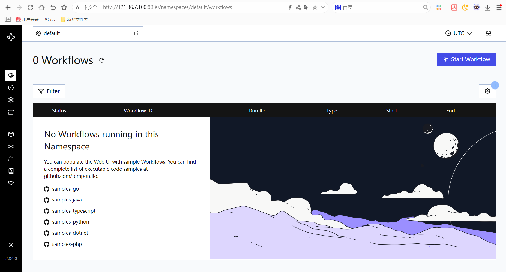

# Temporal分布式工作流管理平台使用指南

# 一、商品链接

[Temporal分布式工作流管理平台](https://marketplace.huaweicloud.com/hidden/contents/425948e6-59f9-495d-a472-85db0d636efb?ticket=ST-8178843-lxjuaQ7eWgV2HygvqEbA9JJW-sso#productid=OFFI1121280798300516352)

# 二、商品说明

Temporal是一个开源的分布式工作流管理平台，旨在简化复杂、有状态应用的开发与运维。它通过提供确定性的执行框架、内置重试机制和持久化日志，确保长时间运行的任务在故障后自动恢复，保障业务逻辑的可靠性。开发者可专注于业务代码，而无需处理分布式系统的容错、队列管理等底层细节，适用于微服务编排、事务处理、定时任务等场景。本商品基于arm架构的Huawei Cloud EulerOS 2.0 64bit系统安装的v1.27.2版本的Temporal。
# 三、商品购买

您可以在云商店搜索 **Temporal分布式工作流管理平台**。

其中，地域、规格、推荐配置使用默认，购买方式根据您的需求选择按需/按月/按年，短期使用推荐按需，长期使用推荐按月/按年，确认配置后点击“立即购买”。

## 3.1 使用 RFS 模板直接部署

必填项填写后，点击 下一步

创建直接计划后，点击 确定

点击部署，执行计划

如下图“Apply required resource success. ”即为资源创建完成

# 3.2ECS 控制台配置

### 准备工作

在使用ECS控制台配置前，需要您提前配置好 **安全组规则**。

> **安全组规则的配置如下：**
> - 入方向规则放通端口8080，源地址内必须包含您的客户端ip，否则无法访问
> - 入方向规则放通 CloudShell 连接实例使用的端口 `22`，以便在控制台登录调试
> - 出方向规则一键放通

### 创建ECS

前提工作准备好后，选择 ECS 控制台配置跳转到[购买ECS](https://support.huaweicloud.com/qs-ecs/ecs_01_0103.html) 页面，ECS 资源的配置如下图所示：

选择CPU架构

选择服务器规格

选择镜像

其他参数根据实际请客进行填写，填写完成之后，点击立即购买即可

> **值得注意的是：**
> - VPC 您可以自行创建
> - 安全组选择 [**准备工作**](#准备工作) 中配置的安全组；
> - 弹性公网IP选择现在购买，推荐选择“按流量计费”，带宽大小可设置为5Mbit/s；
> - 高级配置需要在高级选项支持注入自定义数据，所以登录凭证不能选择“密码”，选择创建后设置；
> - 其余默认或按规则填写即可。

# 商品使用

## Temporal使用

### 通过IP+8080端口访问UI页面

### 参考文档

[Temporal参考文档](https://docs.temporal.io/evaluate/why-temporal)
